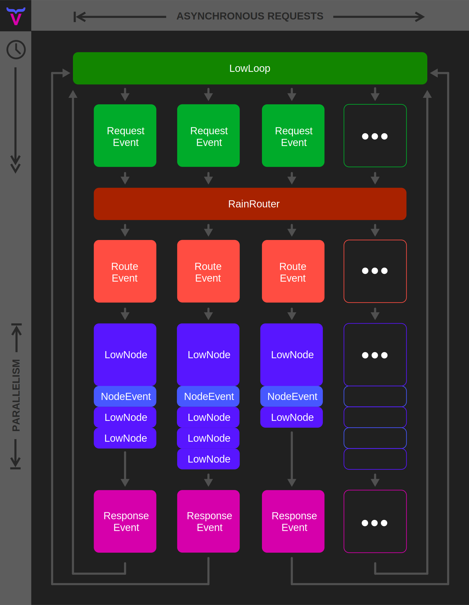

  

# Raindeer

Raindeer is a new web framework using the dynamic features and latest async improvements in Ruby + some weird ideas, to build a new breed of web application. Each Raindeer component can be used individually in your exisiting application, or all together as a cohesive framework. **Deer to be different.**

## Components

### LowType

[LowType](https://github.com/low-rb/low_type) introduces the concept of "type expressions", allowing you to add inline types in your code, only when you need them. LowType is an elegant type checking system with the most minimal DSL possible. It looks like if Ruby had native types; `def method(var: String)`.

### LowLoop

[LowLoop](https://github.com/low-rb/low_loop) is an asynchronous event-driven server that ties into `LowEvent` to create and send events from the request layer right through to the application and data layers. Finally you can see and track events through every step of your application.

### LowEvent

[LowEvent](https://github.com/low-rb/low_event) represents events of all kinds; `RequestEvent`, `RouteEvent` (RainRouter), `RenderEvent` (LowNode) and `ResponseEvent`. Plus you can extend with your own event types.

### RainRouter

The RainRouter accepts `RequestEvent`s and directs the request to the appropriate observers. Simply add `observe 'path/:id'` to a `LowNode` and now it will be called every time a request is made to this route.

### LowNode

[LowNodes](https://github.com/low-rb/low_node) are the flexible building blocks of your application. They can respond to a route request, or they can be called by another node. They can render a return value, or they can create an event. They are designed to be specific enough to observe events and return values, but generic enough to be split up to represent a complex application with its own patterns and structure. Nodes can render HTML/JSON directly from the Ruby class (via RBX, similar to JSX) and render other nodes into the output using Raindeer's special Antlers syntax; `<html><{ ChildNode }></html>`.

### LowData

Instead of the model defining relationships and associated queries to the database, LowData follows the repository pattern with a twist; Expressions. For example, a "table expression" inverts the usual database query logic. Instead of building a query of what we want from the database, we build the table we want and let the expression build the query; An expression like `table(:username > :title | :body)` builds a SQL query to RIGHT JOIN the user table into the articles table and results in a list of articles with the user's username in each row.

## Architecture

  

