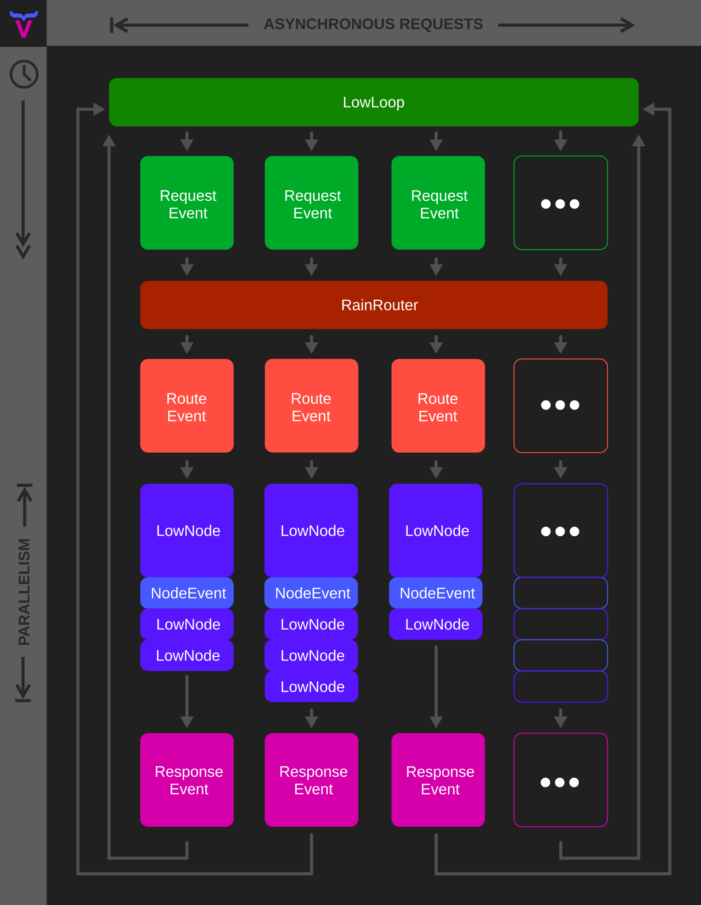

<p align="center"></p>

# Raindeer

<a href="https://rubygems.org/gems/raindeer" title="Install gem"></a>
<a href="https://github.com/raindeer-rb/raindeer" title="GitHub"></a>
<a href="https://codeberg.org/raindeer/raindeer" title="Codeberg"></a>
<a href="https://discord.gg/UBex4JQgnX"></a>
<a href="https://www.rubyforum.org/tag/raindeer"></a>


Raindeer is an event-driven framework using the dynamic features and latest async improvements in Ruby + some weird ideas, to build a new breed of web application. Each Raindeer component can be used individually in your exisiting application, or all together as a cohesive framework. **Deer to be different.**

## Components

See: 🎬 **[Video Overview](https://www.youtube.com/watch?v=p9E5INAwK_4)** of Raindeer

### LowType

[LowType](https://github.com/low-rb/low_type) introduces the concept of "type expressions", allowing you to add inline types in your code, only when you need them. LowType is an elegant type checking system with the most minimal DSL possible. It looks like if Ruby had native types; `def method(var: String)`.

### LowLoop

[LowLoop](https://github.com/low-rb/low_loop) is an asynchronous event-driven server that ties into `LowEvent` to create and send events from the request layer right through to the application and data layers. Finally you can see and track events through every step of your application.

### LowEvent

[LowEvent](https://github.com/low-rb/low_event) represents events of all kinds; Raindeer uses `RequestEvent`, `RouteEvent`, `RenderEvent` and `ResponseEvent`. Plus you can extend with your own event types. Events can be observed with [Observers](https://github.com/raindeer-rb/observers).

### RainRouter

The RainRouter accepts `RequestEvent`s and directs the request to the appropriate observers. Simply add `observe 'path/:id'` to a `LowNode` and now it will be called every time a request is made to this route.

### LowNode

[LowNodes](https://github.com/low-rb/low_node) are the flexible building blocks of your application. They can respond to a route request, or they can be called by another node. They can render a return value, or they can create an event. They are designed to be specific enough to observe events and return values, but generic enough to be split up to represent a complex application with its own patterns and structure. Nodes can render HTML/JSON directly from the Ruby class (via RBX, similar to JSX) and render other nodes into the output using Raindeer's special [Antlers](https://github.com/raindeer-rb/antlers) syntax; `<html><{ ChildNode }></html>`.

### LowData

[LowData](https://github.com/low-rb/low_data) follows the repository pattern with a twist; [Data Expressions](https://github.com/raindeer-rb/expressions). A data expression like `Users[:username] + Posts[:title, :body]` builds a SQL query to `OUTER JOIN` the `Users` table into the `Posts` table and results in a list of posts with the user's username in each row.

## Architecture

Raindeer glues [Low](https://github.com/low-rb) components together with a router, observers, pipelines and client-side integrations. It's decoupled and event-driven in a way that's deceptively simple whilst enabling scalable architectures.

<p align="center">
  
</p>

## Philosophy

### 🥚 Less is more

Anything that just "is how it is" can be made simpler. It can take a lot of time to find a way how but it's worth it. Having grown up dumb; we should really care about people learning new things. People shouldn't have to learn much and one way to do this is by removing things:

- **Namespaces** - Lexical scopes can be confusing and the `::` syntax just doesn't look right. They are optional (and still used internally by Raindeer)
- **Heredoc** - Multi-line HTML can be written directly inside a Ruby class via RBX. See [LowLoad](https://github.com/low-rb/lowload)
- **MVC** - Arbitrary files in arbitrary locations called in an arbitrary order. Just `observe` an event in a [node](https://github.com/low-rb/low_node) and render output, or call more code

### 🧩 The Framework Anti-Pattern

Developers will use patterns applicable to their application that are different to the framework's. This results in a tension between highly rigid framework patterns (MVC) and an application's. We shouldn't fight this but provide compositional entities and events that glue the application together. Raindeer uses [LowNode](https://github.com/low-rb/low_node) to intercept the "request and response" layer then gets out of the way and let's the application structure itself from there.

### 👣 No build steps

<details>
  <summary>Your files should just work out of the box. No one ever asked for a build step and it takes you out of your flow.</summary>

  **No build steps can internally create issues:**
  | **Problem**                     | **Solution**                                                                         |
  |---------------------------------|--------------------------------------------------------------------------------------|
  | Extra runtime processing        | Process once on "Class Load" and clean up at the end of the application's boot stage |
  | Less isolation between concerns | With extra effort we can still isolate these "mixed" concerns internally             |
</details>

### 🪆 Composition over convention

Methods and classes should be *compositional*, so that you can understand their hidden complexity by drilling down into them as they go, rather than calling one magic method that does a bunch of side quests. APIs should be less magical and more compositional.

A perfect example is the `has_many` helper method provided by various ORMs. This method adds "association" methods to a model, then hides the fact that databases do joins on tables. You will have to do a `JOIN` on a table eventually, so it's better to represent tables as being merged together from the start. There has to be a more compositional way that exposes the database structure while letting you query that structure easily. Raindeer uses [LowData](https://github.com/low-rb/low_data) to represent table structure compositionally:

```ruby
class PostsData < LowData
  def all
    Users[:username] + Posts[:title, :body]
  end
end
```

ℹ️ This data expression generates SQL to `OUTER JOIN` the user table with the posts table and results in a list of posts with the user's username included in each row.

## Getting Started

1. Clone [Raindeer Template](https://github.com/raindeer-rb/raindeer-template)
2. Run `bundle install`
3. Run `rain server`
4. Visit http://127.0.0.1:4133/

Soon we'll have a `rain new :app_name` generator command. Could that future be you? It's currently [stubbed](https://github.com/raindeer-rb/raindeer/blob/main/lib/cli/cli.rb).

## Community

Join us in the `raindeer` tag on the [Ruby Users Forum](https://www.rubyforum.org/tag/raindeer).

## Contributing

Raindeer needs developer contributions around:
- Database layer - [SQL generation](https://github.com/low-rb/low_data), performance, migrations
- Deployment layer - Credential management, authentication
- Tooling - [CLI](https://github.com/raindeer-rb/raindeer/blob/main/lib/cli/cli.rb), [Static-site generation](https://raindeer.dev/docs/static)
- Performance testing and fixing

If you have a love for human-written code that's easy to understand then please consider [making a contribution](https://github.com/raindeer-rb/raindeer/issues/1).
